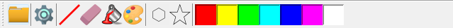

## _ToolButton.java_
It should be the base class for all tool buttons.

>
## Colors
Color pallet of some fixed colors.

## File manager
Button for open some image. 

## Filters
Filters buttons group.

## Instruments
## Setting
Opens **_SettingsFrame_**
## Stamps
